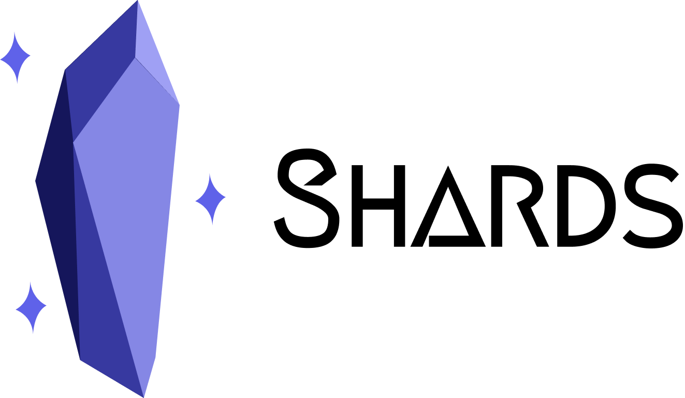

<p align="center">
	<picture>
		<source media="(prefers-color-scheme: dark)" srcset=".github/shard-logo-dark.png">
		
	</picture>
</p>

Shards is a small little utility library for aspiring matchmakers who want to be able to optimize player latency without
too much faff. This library is used in [Basketball: Zero](https://www.roblox.com/games/130739873848552/-)'s ranked
gamemode to a great degree of success.

Now, a budding developer like yourself must be thinking "what is a shard?" Well, shards are a small set of country groups
that roughly match up to where Roblox's server infrastructure is located. When you get a shard for a player, you can feed
that into a matchmaking system to pair them up with players in the same general region, meaning that players get better
ping and experience. This is ideal for competitive or ping-dependent games, but is also just good generally for a smoother
experience for everyone. This also means that you will (in the best conditions) create reserved servers in the best region
for all of the players on a match.

N.B.: Shards does nothing by itself to improve the matchmaking experience, and this library is just a utility wrapper
around the actual data to make it easier to access. It is up to you to utilize the data to your advantage and plug it in
to your systems.

Also yes, I stole the 'shard' terminology from Valorant.

## Documentation

```lua
local Shards = require(...)

-- load the latest shard data from the default source, you should ideally do this once but
-- you can do it as many times as you like
--
-- NOTE: if this does fail, it will use the version of the data built in to your version of
-- the library instead
Shards.loadRemoteShardData()

-- if you want to load data from a custom source, you can do that too:
Shards.loadRemoteShardData("https://example.org/shards.json")

local shardId = Shards.getShardForPlayer(game.Players.lewisakura)
-- if you have a specific country code already (ex. trying to get the server's shard ID
-- instead), you can do that too:
Shards.getShardForCountry("US")

-- the shardId is a numerical ID representing the shard, so to get a display name, you can
-- use getShardName:
print(shardId) -- 1
print(Shards.getShardName(shardId)) -- North America
```

## Installation

### Wally Package

```toml
Shards = "playcurrent/shards@0.1.0"
```

### RBXM Module

Pop over to the [releases](https://github.com/playcurrent/shards/releases)!

## FAQ

### Why a package?

The biggest benefit is that the shard data can be updated remotely, so if an unexpected country code shows up or if
Roblox releases new server regions, we can quickly update games to start using the new entries without needing to release
a game update. Plus, it provides a small little API for people to use to make it easier.

### Why do shards have numerical IDs?

A lot of matchmaking systems actually have quite a hard time with strings. For instance, Amazon's GameLift FlexMatch
(funnily enough, what we use at BB:Z) really does not play nice with string equality in expansion rules, so a numerical
ID is provided as an alternative.

<small>
	Logo modified from Crystal Shard, under CC-BY-SA-4.0 by
	<a href="https://dribbble.com/Chanut-is-Industries">Chanut is Industries</a>
</small>
